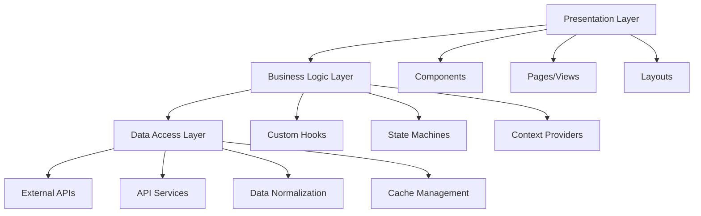

# 🚀 React Enterprise Boilerplate

> **Enterprise-grade React TypeScript boilerplate** with modern architecture, scalable patterns, and best practices for enterprise projects.

## 📋 Table of Contents

- [🎯 Key Features](#-key-features)
- [🏗️ Project Architecture](#️-project-architecture)
- [📁 File Structure](#-file-structure)
- [🛠️ Tech Stack](#️-tech-stack)
- [🚀 Quick Start](#-quick-start)
- [📖 Development Guides](#-development-guides)
- [🧪 Testing](#-testing)
- [📏 Linting and Formatting](#-linting-and-formatting)
- [🔧 Configuration](#-configuration)
- [📚 Patterns and Conventions](#-patterns-and-conventions)
- [🤝 Contributing](#-contributing)

## 🎯 Key Features

### ✅ **Enterprise Architecture**
- **Clear separation of concerns** with layered architecture
- **Scalable state management** with Zustand + Context API + XState
- **Backend data normalization** with consistent patterns
- **Custom hooks** for reusable business logic

### ✅ **Modern Development**
- **React 18** with Concurrent Features
- **TypeScript 5.3** with strict typing
- **Vite** for ultra-fast development
- **React Query (TanStack)** for server state management

### ✅ **Professional UI/UX**
- **Chakra UI** as base design system
- **Accessible components** (WCAG 2.1 AA)
- **Responsive design** mobile-first
- **Dark/Light mode** included

### ✅ **Comprehensive Testing**
- **Vitest** for unit testing
- **Testing Library** for integration testing
- **MSW** for API mocking
- **Automated coverage reports**

### ✅ **Code Quality**
- **ESLint** with enterprise rules
- **Prettier** for consistent formatting
- **Husky** for git hooks
- **Lint-staged** for clean commits

### ✅ **Developer Experience**
- **Instant Hot Module Replacement**
- **TypeScript strict mode** enabled
- **Path mapping** configured
- **Optimized debugging**

## 🏗️ Project Architecture



### **Architectural Principles**

1. **Single Responsibility**: Each module has a specific responsibility
2. **Dependency Inversion**: We depend on abstractions, not implementations
3. **Open/Closed**: Open for extension, closed for modification
4. **Composition over Inheritance**: We favor composition over inheritance

## 📁 File Structure

```
src/
├── 📁 components/           # Reusable components
│   ├── 📁 ui/              # Base design system components
│   ├── 📁 forms/           # Form components
│   ├── 📁 layout/          # Layout components
│   └── 📁 common/          # Common components
├── 📁 pages/               # Main pages/views
│   ├── 📁 dashboard/       # Dashboard and sub-pages
│   ├── 📁 auth/           # Authentication
│   └── 📁 settings/       # Settings
├── 📁 hooks/               # Custom hooks
│   ├── 📁 api/            # API hooks
│   ├── 📁 business/       # Business logic
│   └── 📁 ui/             # UI hooks
├── 📁 services/            # Services and APIs
│   ├── 📁 api/            # API configuration
│   ├── 📁 auth/           # Authentication services
│   └── 📁 storage/        # Storage management
├── 📁 stores/              # Global state (Zustand)
│   ├── 📁 slices/         # State slices
│   └── 📁 machines/       # State machines (XState)
├── 📁 types/               # Type definitions
│   ├── 📁 api/            # API types
│   ├── 📁 business/       # Domain types
│   └── 📁 ui/             # UI types
├── 📁 utils/               # Utilities and helpers
│   ├── 📁 formatters/     # Data formatting
│   ├── 📁 validators/     # Validations
│   └── 📁 constants/      # Constants
├── 📁 styles/              # Global styles and themes
├── 📁 assets/              # Static resources
└── 📁 __tests__/           # Global tests and setup
```

## 🛠️ Tech Stack

### **Core**
- **React 18.2** - UI library with Concurrent Features
- **TypeScript 5.3** - Static typing for JavaScript
- **Vite 5.0** - Ultra-fast build tool and dev server

### **State and Data**
- **TanStack Query 5.0** - Server state management
- **Zustand 4.4** - Lightweight global state
- **XState 4.38** - State machines for complex logic
- **React Hook Form 7.48** - Performant form management

### **UI and Styling**
- **Chakra UI 2.8** - Modular component system
- **Framer Motion 10.16** - Smooth animations
- **React Helmet Async** - Document head management

### **Networking**
- **Axios 1.6** - HTTP client with interceptors
- **MSW 2.0** - API mocking for testing

### **Validation**
- **Zod 3.22** - Schema validation with TypeScript
- **Hookform Resolvers** - React Hook Form integration

### **Testing**
- **Vitest 1.0** - Fast and modern test runner
- **Testing Library** - User-centric testing
- **JSDOM** - DOM simulation for tests

### **Code Quality**
- **ESLint 8.55** - Linting with custom rules
- **Prettier 3.1** - Consistent code formatting
- **Husky 8.0** - Automated git hooks

## 🚀 Quick Start

### **Prerequisites**
- Node.js 18+ 
- npm/yarn/pnpm
- Git

### **Installation**

```bash
# 1. Clone the repository
git clone <repository-url>
cd react-enterprise-boilerplate

# 2. Install dependencies
npm install
# or
yarn install

# 3. Set up environment variables
cp .env.example .env.local

# 4. Start development
npm run dev
```

### **Available Scripts**

```bash
# Development
npm run dev              # Start development server
npm run build           # Build for production
npm run preview         # Preview production build

# Testing
npm run test            # Run tests
npm run test:ui         # Test UI
npm run test:coverage   # Coverage report

# Code Quality
npm run lint            # Run linting
npm run lint:fix        # Auto-fix lint issues
npm run format          # Format code
npm run type-check      # Check TypeScript types
```

## 📖 Development Guides

### **1. Creating a New Component**

```typescript
// src/components/ui/Button/Button.tsx
import React from 'react';
import { Button as ChakraButton, ButtonProps } from '@chakra-ui/react';

interface CustomButtonProps extends ButtonProps {
  variant?: 'primary' | 'secondary' | 'danger';
  loading?: boolean;
}

export const Button: React.FC<CustomButtonProps> = ({
  variant = 'primary',
  loading = false,
  children,
  ...props
}) => {
  return (
    <ChakraButton
      isLoading={loading}
      colorScheme={variant === 'danger' ? 'red' : 'blue'}
      variant={variant === 'secondary' ? 'outline' : 'solid'}
      {...props}
    >
      {children}
    </ChakraButton>
  );
};

// src/components/ui/Button/Button.test.tsx
import { render, screen } from '@testing-library/react';
import { Button } from './Button';

describe('Button', () => {
  it('renders correctly', () => {
    render(<Button>Click me</Button>);
    expect(screen.getByRole('button')).toBeInTheDocument();
  });
});

// src/components/ui/Button/index.ts
export { Button } from './Button';
export type { CustomButtonProps } from './Button';
```

### **2. Creating a Custom Hook**

```typescript
// src/hooks/api/useUsers.ts
import { useQuery, useMutation, useQueryClient } from '@tanstack/react-query';
import { userService } from '@/services/api/userService';
import type { User, CreateUserRequest } from '@/types/api/user';

export const useUsers = () => {
  return useQuery({
    queryKey: ['users'],
    queryFn: userService.getAll,
    staleTime: 5 * 60 * 1000, // 5 minutes
  });
};

export const useCreateUser = () => {
  const queryClient = useQueryClient();
  
  return useMutation({
    mutationFn: userService.create,
    onSuccess: () => {
      queryClient.invalidateQueries({ queryKey: ['users'] });
    },
  });
};

// src/hooks/api/useUsers.test.ts
import { renderHook, waitFor } from '@testing-library/react';
import { QueryClient, QueryClientProvider } from '@tanstack/react-query';
import { useUsers } from './useUsers';

const createWrapper = () => {
  const queryClient = new QueryClient({
    defaultOptions: { queries: { retry: false } },
  });
  
  return ({ children }: { children: React.ReactNode }) => (
    <QueryClientProvider client={queryClient}>
      {children}
    </QueryClientProvider>
  );
};

describe('useUsers', () => {
  it('fetches users successfully', async () => {
    const { result } = renderHook(() => useUsers(), {
      wrapper: createWrapper(),
    });

    await waitFor(() => {
      expect(result.current.isSuccess).toBe(true);
    });
  });
});
```

### **3. State Management with Zustand**

```typescript
// src/stores/slices/authSlice.ts
import { create } from 'zustand';
import { devtools, persist } from 'zustand/middleware';
import type { User } from '@/types/api/user';

interface AuthState {
  user: User | null;
  isAuthenticated: boolean;
  token: string | null;
}

interface AuthActions {
  login: (user: User, token: string) => void;
  logout: () => void;
  updateUser: (user: Partial<User>) => void;
}

type AuthStore = AuthState & AuthActions;

export const useAuthStore = create<AuthStore>()(
  devtools(
    persist(
      (set, get) => ({
        // State
        user: null,
        isAuthenticated: false,
        token: null,

        // Actions
        login: (user, token) => {
          set({
            user,
            token,
            isAuthenticated: true,
          });
        },

        logout: () => {
          set({
            user: null,
            token: null,
            isAuthenticated: false,
          });
        },

        updateUser: (userData) => {
          const currentUser = get().user;
          if (currentUser) {
            set({
              user: { ...currentUser, ...userData },
            });
          }
        },
      }),
      {
        name: 'auth-storage',
        partialize: (state) => ({
          token: state.token,
          user: state.user,
        }),
      }
    ),
    { name: 'auth-store' }
  )
);
```

### **4. State Machines with XState**

```typescript
// src/stores/machines/formMachine.ts
import { createMachine, assign } from 'xstate';

interface FormContext {
  data: Record<string, any>;
  errors: Record<string, string>;
  submitCount: number;
}

type FormEvent =
  | { type: 'SUBMIT'; data: Record<string, any> }
  | { type: 'VALIDATE'; field: string; value: any }
  | { type: 'RESET' }
  | { type: 'SUCCESS' }
  | { type: 'ERROR'; errors: Record<string, string> };

export const formMachine = createMachine<FormContext, FormEvent>({
  id: 'form',
  initial: 'idle',
  context: {
    data: {},
    errors: {},
    submitCount: 0,
  },
  states: {
    idle: {
      on: {
        SUBMIT: {
          target: 'validating',
          actions: assign({
            data: (_, event) => event.data,
            submitCount: (context) => context.submitCount + 1,
          }),
        },
        VALIDATE: {
          actions: assign({
            data: (context, event) => ({
              ...context.data,
              [event.field]: event.value,
            }),
          }),
        },
      },
    },
    validating: {
      invoke: {
        id: 'validateForm',
        src: 'validateForm',
        onDone: {
          target: 'submitting',
          actions: assign({ errors: {} }),
        },
        onError: {
          target: 'idle',
          actions: assign({
            errors: (_, event) => event.data,
          }),
        },
      },
    },
    submitting: {
      invoke: {
        id: 'submitForm',
        src: 'submitForm',
        onDone: 'success',
        onError: {
          target: 'idle',
          actions: assign({
            errors: (_, event) => event.data,
          }),
        },
      },
    },
    success: {
      on: {
        RESET: {
          target: 'idle',
          actions: assign({
            data: {},
            errors: {},
            submitCount: 0,
          }),
        },
      },
    },
  },
});

// src/hooks/business/useFormMachine.ts
import { useMachine } from '@xstate/react';
import { formMachine } from '@/stores/machines/formMachine';

export const useFormMachine = (
  validateFn: (data: any) => Promise<any>,
  submitFn: (data: any) => Promise<any>
) => {
  const [state, send] = useMachine(formMachine, {
    services: {
      validateForm: async (context) => {
        const errors = await validateFn(context.data);
        if (Object.keys(errors).length > 0) {
          throw errors;
        }
        return true;
      },
      submitForm: async (context) => {
        return await submitFn(context.data);
      },
    },
  });

  return {
    state,
    send,
    isIdle: state.matches('idle'),
    isValidating: state.matches('validating'),
    isSubmitting: state.matches('submitting'),
    isSuccess: state.matches('success'),
    data: state.context.data,
    errors: state.context.errors,
    submitCount: state.context.submitCount,
  };
};
```

## 🧪 Testing

### **Testing Strategy**

1. **Unit Tests**: Pure functions and hooks
2. **Integration Tests**: Components with dependencies
3. **E2E Tests**: Complete user flows

### **Testing Configuration**

```typescript
// src/__tests__/setup.ts
import '@testing-library/jest-dom';
import { server } from './mocks/server';

// Establish MSW
beforeAll(() => server.listen());
afterEach(() => server.resetHandlers());
afterAll(() => server.close());

// src/__tests__/utils/test-utils.tsx
import React from 'react';
import { render, RenderOptions } from '@testing-library/react';
import { QueryClient, QueryClientProvider } from '@tanstack/react-query';
import { ChakraProvider } from '@chakra-ui/react';
import { BrowserRouter } from 'react-router-dom';

const AllTheProviders = ({ children }: { children: React.ReactNode }) => {
  const queryClient = new QueryClient({
    defaultOptions: {
      queries: { retry: false },
      mutations: { retry: false },
    },
  });

  return (
    <BrowserRouter>
      <QueryClientProvider client={queryClient}>
        <ChakraProvider>
          {children}
        </ChakraProvider>
      </QueryClientProvider>
    </BrowserRouter>
  );
};

const customRender = (
  ui: React.ReactElement,
  options?: Omit<RenderOptions, 'wrapper'>
) => render(ui, { wrapper: AllTheProviders, ...options });

export * from '@testing-library/react';
export { customRender as render };
```

### **Mocking with MSW**

```typescript
// src/__tests__/mocks/handlers.ts
import { rest } from 'msw';
import type { User } from '@/types/api/user';

export const handlers = [
  rest.get('/api/users', (req, res, ctx) => {
    return res(
      ctx.json([
        { id: '1', name: 'John Doe', email: 'john@example.com' },
        { id: '2', name: 'Jane Smith', email: 'jane@example.com' },
      ])
    );
  }),

  rest.post('/api/users', async (req, res, ctx) => {
    const newUser = await req.json();
    return res(
      ctx.status(201),
      ctx.json({ id: '3', ...newUser })
    );
  }),
];

// src/__tests__/mocks/server.ts
import { setupServer } from 'msw/node';
import { handlers } from './handlers';

export const server = setupServer(...handlers);
```

## 📏 Linting and Formatting

### **ESLint Configuration**

```javascript
// .eslintrc.js
module.exports = {
  root: true,
  env: { browser: true, es2020: true },
  extends: [
    'eslint:recommended',
    '@typescript-eslint/recommended',
    'plugin:react-hooks/recommended',
    'plugin:react/recommended',
    'plugin:jsx-a11y/recommended',
    'plugin:import/recommended',
    'plugin:import/typescript',
    'prettier',
  ],
  ignorePatterns: ['dist', '.eslintrc.js'],
  parser: '@typescript-eslint/parser',
  plugins: ['react-refresh'],
  rules: {
    'react-refresh/only-export-components': [
      'warn',
      { allowConstantExport: true },
    ],
    'react/react-in-jsx-scope': 'off',
    '@typescript-eslint/no-unused-vars': ['error', { argsIgnorePattern: '^_' }],
    'import/order': [
      'error',
      {
        groups: [
          'builtin',
          'external',
          'internal',
          'parent',
          'sibling',
          'index',
        ],
        'newlines-between': 'always',
        alphabetize: { order: 'asc' },
      },
    ],
  },
  settings: {
    react: { version: '18.2' },
    'import/resolver': {
      typescript: {},
    },
  },
};
```

### **Prettier Configuration**

```json
// .prettierrc
{
  "semi": true,
  "trailingComma": "es5",
  "singleQuote": true,
  "printWidth": 80,
  "tabWidth": 2,
  "useTabs": false
}
```

## 🔧 Configuration

### **Environment Variables**

```bash
# .env.example
VITE_API_BASE_URL=http://localhost:3001/api
VITE_APP_NAME=React Enterprise App
VITE_APP_VERSION=1.0.0
VITE_ENABLE_DEVTOOLS=true
```

### **TypeScript Configuration**

```json
// tsconfig.json
{
  "compilerOptions": {
    "target": "ES2020",
    "useDefineForClassFields": true,
    "lib": ["ES2020", "DOM", "DOM.Iterable"],
    "module": "ESNext",
    "skipLibCheck": true,
    "moduleResolution": "bundler",
    "allowImportingTsExtensions": true,
    "resolveJsonModule": true,
    "isolatedModules": true,
    "noEmit": true,
    "jsx": "react-jsx",
    "strict": true,
    "noUnusedLocals": true,
    "noUnusedParameters": true,
    "noFallthroughCasesInSwitch": true,
    "baseUrl": ".",
    "paths": {
      "@/*": ["src/*"],
      "@/components/*": ["src/components/*"],
      "@/hooks/*": ["src/hooks/*"],
      "@/services/*": ["src/services/*"],
      "@/types/*": ["src/types/*"],
      "@/utils/*": ["src/utils/*"]
    }
  },
  "include": ["src"],
  "references": [{ "path": "./tsconfig.node.json" }]
}
```

### **Vite Configuration**

```typescript
// vite.config.ts
import { defineConfig } from 'vite';
import react from '@vitejs/plugin-react';
import path from 'path';

export default defineConfig({
  plugins: [react()],
  resolve: {
    alias: {
      '@': path.resolve(__dirname, './src'),
    },
  },
  server: {
    port: 3000,
    open: true,
  },
  build: {
    outDir: 'dist',
    sourcemap: true,
  },
  test: {
    globals: true,
    environment: 'jsdom',
    setupFiles: ['./src/__tests__/setup.ts'],
  },
});
```

## 📚 Patterns and Conventions

### **Naming Conventions**

```typescript
// ✅ Correct
const UserProfile = () => { /* ... */ };           // PascalCase for components
const useUserData = () => { /* ... */ };           // camelCase for hooks
const API_BASE_URL = 'https://api.example.com';    // UPPER_SNAKE_CASE for constants
const userService = { /* ... */ };                 // camelCase for services

// ❌ Incorrect
const userprofile = () => { /* ... */ };
const UseUserData = () => { /* ... */ };
const apiBaseUrl = 'https://api.example.com';
```

### **File Organization**

```typescript
// ✅ Recommended structure for components
src/components/UserCard/
├── UserCard.tsx          // Main component
├── UserCard.test.tsx     // Tests
├── UserCard.stories.tsx  // Storybook (optional)
├── UserCard.styles.ts    // Specific styles
├── hooks/                // Component-specific hooks
│   └── useUserCard.ts
├── types.ts              // Specific types
└── index.ts              // Barrel export
```

### **Import/Export Patterns**

```typescript
// ✅ Barrel exports
// src/components/index.ts
export { Button } from './ui/Button';
export { UserCard } from './UserCard';
export { Layout } from './layout/Layout';

// ✅ Named exports preferred
export const UserService = {
  getAll: () => { /* ... */ },
  getById: (id: string) => { /* ... */ },
};

// ✅ Import organization
import React from 'react';                    // External libraries first
import { Button } from '@chakra-ui/react';

import { UserCard } from '@/components';      // Internal imports
import { useUsers } from '@/hooks/api';

import type { User } from '@/types/api';      // Types last
```

### **Error Handling Patterns**

```typescript
// ✅ Error boundaries
class ErrorBoundary extends React.Component {
  constructor(props) {
    super(props);
    this.state = { hasError: false };
  }

  static getDerivedStateFromError(error) {
    return { hasError: true };
  }

  componentDidCatch(error, errorInfo) {
    console.error('Error caught by boundary:', error, errorInfo);
  }

  render() {
    if (this.state.hasError) {
      return <ErrorFallback />;
    }

    return this.props.children;
  }
}

// ✅ Hook error handling
const useAsyncOperation = <T,>(
  operation: () => Promise<T>
) => {
  const [state, setState] = useState<{
    data: T | null;
    error: Error | null;
    loading: boolean;
  }>({
    data: null,
    error: null,
    loading: false,
  });

  const execute = useCallback(async () => {
    setState(prev => ({ ...prev, loading: true, error: null }));
    
    try {
      const data = await operation();
      setState({ data, error: null, loading: false });
    } catch (error) {
      setState({ 
        data: null, 
        error: error as Error, 
        loading: false 
      });
    }
  }, [operation]);

  return { ...state, execute };
};
```

## 🤝 Contributing

### **Development Workflow**

1. **Create feature branch**: `git checkout -b feature/new-functionality`
2. **Develop with TDD**: Write tests first
3. **Commit with conventional commits**: `feat: add user authentication`
4. **Push and create PR**: Include detailed description
5. **Code review**: At least 1 approval required
6. **Merge**: Squash and merge preferred

### **Conventional Commits**

```bash
feat: add user authentication system
fix: resolve memory leak in data fetching
docs: update API documentation
style: format code with prettier
refactor: extract user service logic
test: add integration tests for auth flow
chore: update dependencies
```

### **Pull Request Template**

```markdown
## 📝 Description
Brief description of the changes made.

## 🔄 Type of change
- [ ] Bug fix (change that fixes an issue)
- [ ] New feature (change that adds functionality)
- [ ] Breaking change (change that breaks compatibility)
- [ ] Documentation

## ✅ Checklist
- [ ] Tests added/updated
- [ ] Documentation updated
- [ ] Linting passing
- [ ] Build successful
- [ ] Self-review completed

## 🧪 Testing
Describe how this change has been tested.

## 📸 Screenshots (if applicable)
Add screenshots if there are visual changes.
```

---

## 🎯 **Next Steps**

1. **Clone and configure** the project
2. **Review the complete documentation**
3. **Run the included examples**
4. **Adapt to specific project needs**
5. **Contribute improvements** to the boilerplate

---

**Questions or suggestions?** Open an issue or contact the development team.

**Happy coding! 🚀**
